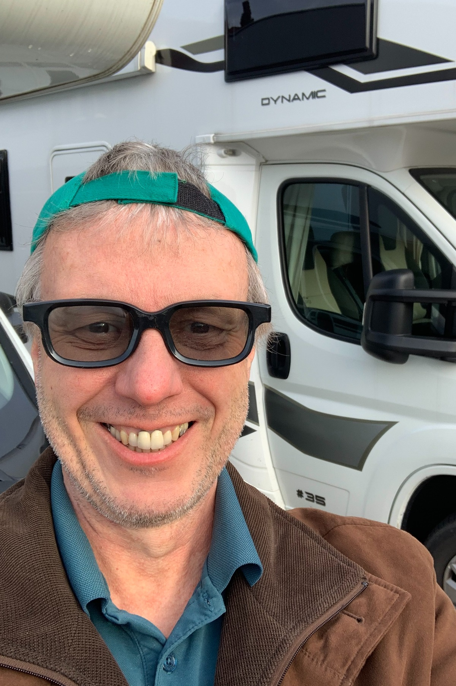

+++
"@type" = "Article"
"@id" = "https://oliverkandler.github.com/visual/"
url = "https://oliverkandler.github.com/visual/"
name = "Oliver Kandler's Author Pages"
headline = "Oliver Kandler's Writing"
datePublished = "2024-02-05T15:52:13+02:00"
dateModified = "2024-02-05T15:52:13+02:00"
image = "./images/OliverKandler_travel_1200x1800.jpeg"
# [image]
# "@type" = "ImageObject"
# "@id" = "https://oliverkandler.github.com/assets/images/Kaj-Kandler-Profile-Pages.png" 
# url = "./assets/images/Kaj-Kandler-Profile-Pages.png"
# contentUrl = "./assets/images/Kaj-Kandler-Profile-Pages.png"
# caption = "Kaj Kandler&apos;s Social Profiles"

[[author]]
"@type" = "Person"
"@id" = "https://oliverkandler.github.com/"
name = "Oliver Kandler"
url = "https://oliverkandler.github.com/"

[mainEntityOfPage]
"@type" = "WebPage"
"@id" = "https://oliverkandler.github.com/visual/#webpage"
name = "Author Pages for Oliver Kandler"
url = "https://oliverkandler.github.com/visual/"
[[mainEntityOfPage.isPartOf]]
"@type" = "WebSite"
"@id" = "https://oliverkandler.github.com/#website"

[[isPartOf]]
"@type" = "WebPage"
"@id" = "https://oliverkandler.github.com/visual/#webpage"

[["@graph"]]
"@type" = "Person"
"@id" = "https://oliverkandler.github.com/#schema/person/2345678901"
name = "Oliver Kandler"
alternateName = [ 
]
familyName = "Kandler"
givenName = "Oliver"
jobTitle = "Writer"
disambiguatingDescription = "Oliver Kandler: Writer and Finance Geek. Oliver Kandler was born 1964 in Germany."
url = "https://oliverkandler.github.com/"
sameAs = [
    "https://www.google.com/search?kgmid=/g/11kbdg_htj",
    "https://smartpersonalfinance.info/author/oliverkandler/",
    "https://www.linkedin.com/in/oliver-kandler-spf/",
    "https://medium.com/@oliverkandler",
    "https://www.reddit.com/user/SmartPerFinance",
    "https://www.facebook.com/oliver.kandler.spf",
]
["@graph".birthPlace]
"@type" = "Country"
["@graph".birthPlace.address]
"@type" = "PostalAddress"
addressCountry = "Germany"
["@graph".nationality]
"@type" = "Country"
name = "Germany"

[["@graph"]]
"@type" = "WebSite"
"@id" = "https://oliverkandler.github.com/#website"
name = "Oliver Kandler"
alternateName = "Oliver Kandler, German Personal Finance Writer"
url = "https://oliverkandler.github.com/"

[[about]]
"@type" = "ItemList"
"@id" = "https://oliverkandler.github.com/visual/#itemlist"
name = "List of Oliver Kandler's author Pages"
"numberOfItems" = 3
[[about.itemListElement]]
"@type" = "ListItem"
"position" = 1
[about.itemListElement.item]
"@type" = "ProfilePage"
"@id" = "https://oliverkandler.github.com/#youtube"
[[about.itemListElement]]
"@type" = "ListItem"
"position" = 2
[about.itemListElement.item]
"@type" = "ProfilePage"
"@id" = "https://oliverkandler.github.com/#flickr"
[[about.itemListElement]]
"@type" = "ListItem"
"position" = 3
[about.itemListElement.item]
"@type" = "ProfilePage"
"@id" = "https://oliverkandler.github.com/#pixabay"

[["@graph"]]
"@type" = "ProfilePage"
"@id" = "https://oliverkandler.github.com/#youtube"
"name" = "Oliver Kandler @ YouTube"
alternateName = [
    "@smartpersonalfinance366",
    "Smart Personal Finance Info @ YouTube"
]
"url" = "https://www.youtube.com/channel/UCohYBiI9kdmrIMskMlGrixA"
"description" = "Oliver Kandler publishes videos at YouTube and curates some play lists on his channel."
[["@graph".mainEntity]]
"@type" = "Person"
"@id" = "https://oliverkandler.github.io/"
"name" = "Oliver Kandler"
"sameAs" = [
    "https://www.google.com/search?kgmid=/g/11kbdg_htj",
    "https://oliverkandler.github.io/",
    "https://www.linkedin.com/in/oliver-kandler-spf/",
    "https://smartpersonalfinance.info/author/oliverkandler/",
    "https://www.youtube.com/channel/UCohYBiI9kdmrIMskMlGrixA"
]
[["@graph".partOf]]
"@type" = "Website"
"@id" = "https://www.youtube.com/#website"
"url" = "https://www.youtube.com/"
"name" = "YouTube"
alternateName = [
    "youtube.com"
]
"sameAs" = [
    "https://www.google.com/search?kgmid=/m/09jcvs",
    "https://www.youtube.com/",
    "https://en.wikipedia.org/wiki/YouTube"
] 

[["@graph"]]
"@type" = "ProfilePage"
"@id" = "https://oliverkandler.github.com/#flickr"
"name" = "Oliver Kandler @ Flickr"
"url" = "https://www.flickr.com/people/oliverkandler/"
"description" = "Oliver Kandler publishes some random photography to Flickr. His preferred subject is plants and landscapes throughout the seasons."
[["@graph".mainEntity]]
"@type" = "Person"
"@id" = "https://oliverkandler.github.io/"
"name" = "Oliver Kandler"
"sameAs" = [
    "https://www.google.com/search?kgmid=/g/11kbdg_htj",
    "https://oliverkandler.github.io/",
    "https://www.linkedin.com/in/oliver-kandler-spf/",
    "https://www.flickr.com/people/oliverkandler/", 
    "https://www.flickr.com/people/196447828@N02/"
]
[["@graph".partOf]]
"@type" = "Website"
"@id" = "https://www.flickr.com/#website"
"url" = "https://www.flickr.com/"
"name" = "Flickr"
"sameAs" = [
    "https://www.google.com/search?kgmid=/m/04dtx9",
    "https://www.flickr.com/",
    "https://en.wikipedia.org/wiki/Flickr"
] 

[["@graph"]]
"@type" = "ProfilePage"
"@id" = "https://oliverkandler.github.com/#pixabay"
"name" = "Oliver Kandler @ Pixabay"
"url" = "https://pixabay.com/users/smartpersonalfinance-30106365/"
"description" = "Oliver Kandler publishes some photos on Pixabay."
[["@graph".mainEntity]]
"@type" = "Person"
"@id" = "https://oliverkandler.github.io/"
"name" = "Oliver Kandler"
"sameAs" = [
    "https://www.google.com/search?kgmid=/g/11kbdg_htj",
    "https://oliverkandler.github.io/",
    "https://www.linkedin.com/in/oliver-kandler-spf/",
    "https://pixabay.com/users/smartpersonalfinance-30106365/"
]
[["@graph".partOf]]
"@type" = "Website"
"@id" = "https://pixabay.com/#website"
"url" = "https://pixabay.com/"
"name" = "Pixabay"
"sameAs" = [
    "https://www.google.com/search?kgmid=/m/0rf9hgr",
    "https://pixabay.com/",
    "https://en.wikipedia.org/wiki/Pixabay"
] 

# ####
#    "https://www.youtube.com/channel/UCohYBiI9kdmrIMskMlGrixA",
#    "https://www.flickr.com/people/oliverkandler/", "https://www.flickr.com/people/196447828@N02/"
#    "https://pixabay.com/users/smartpersonalfinance-30106365/"
+++

# Oliver Kandler's visual Profile Pages

## YouTube

Oliver Kandler publishes some videos on [YouTube](https://www.youtube.com/channel/UCohYBiI9kdmrIMskMlGrixA) and curates some Playlists.

## Flickr

On Flickr Oliver Kandler publishes some [random photography](https://www.flickr.com/people/oliverkandler/). His phtotos are mostly of nature thoughout the seasons.

## Pixabay

Oliver Kandler publishes some [photos on Pixabay](https://pixabay.com/users/smartpersonalfinance-30106365/).